# Newsdesk — Design Document

**Watchlist-driven news collection agent with provenance-first logging.**
Version 0.1 (M0 scaffold) · September 2026 · Status: active development

---

## 1. Product definition

Newsdesk is a local-first agent that monitors sources you choose, normalizes and
deduplicates what they publish, ranks it against your watchlists, and compiles an
**immutable, searchable research log** in which every claim can be traced back to
stored source material.

The product object is the **watchlist**, not the feed and not the digest:

- Topics, entities, keywords, and exclusions.
- Specific publishers, authors, channels, podcasts, forums, newsletters.
- Geographic, language, and time constraints.
- Importance rules — "alert me immediately" vs. "include only in the weekly digest".
- Preferred output: brief summary, detailed report, timeline, comparison, raw source list.

### 1.1 Differentiation

| Capability | Inoreader / Feedly | Readwise-style readers | **Newsdesk** |
|---|---|---|---|
| Flexible source & topic definitions | feeds + filters | saves | watchlists as first-class objects |
| Provenance / evidence tracking | — | partial | every item: URL, hashes, snapshot, retrieval time |
| Multimedia ingestion | partial | strong reading | staged: metadata → transcripts → timestamped chunks |
| User-controlled ranking | rules | manual | explicit feedback + preference learning (M4+) |
| Runtime portability | closed | closed | plain HTTP + MCP protocol; no harness lock-in |
| Durable research log | digest-oriented | read-oriented | append-only log with revisions and tombstones |

### 1.2 Non-goals (v1)

- No credentialed, evasive, or paywall-circumventing scraping.
- No opaque "AI credibility score" presented as objective truth.
- No multi-tenancy until the single-user loop is measurably useful.

---

## 2. System architecture

```mermaid
flowchart LR
    A[Source registry] --> B[Fetchers]
    B --> C[Raw capture]
    C --> D[Parsing and transcription]
    D --> E[Normalization]
    E --> F[Deduplication and clustering]
    F --> G[Relevance and credibility scoring]
    G --> H[Evidence backed summaries]
    H --> I[Log and search index]
    I --> J[Alerts, digests, agent queries]
```



Component map (mirrors the package layout):

| Layer | Package | Responsibility |
|---|---|---|
| Ingestion | `newsdesk.ingest` | politeness, fetching, raw capture, parsing |
| Pipeline | `newsdesk.pipeline` | normalization, dedup, scoring, orchestration |
| Storage | `newsdesk.storage` | repositories, schema, full-text index, log |
| Models | `newsdesk.core` | adapters for LLM access, domain records |
| LLM | `newsdesk.llm` | extraction / embedding / ranking / summarization adapters |
| Interface | `newsdesk.api`, `newsdesk.agents`, `newsdesk.cli` | HTTP API, agent protocol, command line |

Each pipeline stage has a contract: defined input, defined output, defined failure
mode (skip item / skip source / abort run), and a log entry on anything noteworthy.
A failing source never aborts a run; a failing item never aborts a source.

---

## 3. Domain model

### 3.1 Entities

| Entity | Purpose | Key fields |
|---|---|---|
| `Source` | a registered feed/channel/page | url, kind, publisher, enabled, fetch_interval, etag/last_modified, last_status |
| `Watchlist` | the primary product object | name, description |
| `WatchlistTerm` | include/exclude/entity/topic term | term, kind, weight |
| `WatchlistSource` | watchlist ↔ source association | — |
| `Item` | one normalized story, the canonical record | see 3.2 |
| `Cluster` *(M2)* | one real-world event across many items | members, canonical member |
| `Digest` / `AlertRule` *(M4)* | scheduled or immediate outputs | watchlist, period, format |
| `Job` | one collection run | status, per-source stats |
| `LogEntry` | append-only activity log | ts, actor (system/user/agent), action, detail |

### 3.2 The canonical record

Every item is stored and exchanged in exactly this shape (implemented by
`Item.to_canonical()`):

```json
{
  "id": "item_123",
  "source": {
    "publisher": "Example News",
    "url": "https://example.com/story",
    "kind": "article",
    "author": "Jane Reporter"
  },
  "timestamps": {
    "published_at": "2026-09-14T09:00:00+00:00",
    "retrieved_at": "2026-09-14T09:08:00+00:00"
  },
  "content": {
    "title": "Example headline",
    "text": "...",
    "media": [],
    "transcript": null
  },
  "analysis": {
    "topics": ["energy", "policy"],
    "entities": ["Example Organization"],
    "relevance": 0.91,
    "claims": []
  },
  "provenance": {
    "content_hash": "...",
    "extraction_method": "rss",
    "url_canonical": "https://example.com/story",
    "snapshot_path": "...",
    "simhash": "0f3a...",
    "revision": 0,
    "duplicate_of": null
  }
}
```

Notes:

- `id` is derived deterministically from the canonical URL, so re-fetching the
  same story is idempotent with no coordination.
- `content_hash` covers title + body **only** (whitespace-normalized, URL excluded),
  so verbatim syndication across outlets is detectable while wording changes
  still register as revisions.
- `analysis.relevance` is a v1 keyword score against watchlist include-terms; it
  is a ranking input, never a credibility judgment.
- `provenance.snapshot_path` points at the raw captured payload on disk, so any
  later claim can be re-verified against what the source actually served.

### 3.3 Item lifecycle

```
created ──(hash change)──> revised (revision++ , logged) ──> tombstoned
   │                                                        (source deleted / retracted)
   └──(same content hash at another URL)──> duplicate (linked via duplicate_of)
```

Rows are never silently dropped: revisions keep history in the log, syndicated
copies stay linked so a cluster can always show *independent confirmation vs.
repeated syndication*, and removals become tombstones.

---

## 4. Pipeline stages

| # | Stage | Input → Output | Failure mode |
|---|---|---|---|
| 1 | Source registry | user/agent intent → enabled `Source`s | invalid source rejected at add time |
| 2 | Fetchers | `Source` → `RawCapture` (bytes + hash + snapshot) | per-source error, logged, run continues |
| 3 | Parsing | `RawCapture` bytes → `RawEntry[]` | unparseable payload → FetchError |
| 4 | Normalization | `RawEntry[]` → canonical item dicts | entries without URL are skipped |
| 5 | Dedup/clustering | items → created / unchanged / revised / duplicate | never destructive |
| 6 | Scoring | items + watchlist terms → relevance signal | missing terms → null relevance |
| 7 | Summarization *(M3)* | item cluster → evidence-linked summary | model failure → stored error, items remain |
| 8 | Log & index | outcomes → `LogEntry[]`, FTS rows | trigger-maintained, atomic with item writes |
| 9 | Outputs *(M4)* | log + watchlists → alerts, digests, exports | delivery failure retried, logged |

The runner (`pipeline/runner.py`) creates one `Job` per pass, processes every
enabled source independently, aggregates per-source stats into `job.stats`, and
appends log entries for `job_started`, `item_created`, `item_revised`,
`source_collected`, `source_error`, `source_skipped`, `source_not_modified`,
`job_finished`.

---

## 5. Ingestion

### 5.1 Adapter kinds and rollout order

1. **RSS/Atom** (M0, shipped) — preferred low-cost path with conditional GET.
2. **HTML extraction** (M2) — readability-style extraction on permitted pages.
3. **Sitemap discovery** (M2) — structured metadata for publishers without feeds.
4. **Publisher APIs** (M2+) — where offered.
5. **YouTube / podcast / video metadata** (M5) — titles, descriptions, captions.
6. **Transcription** (M5) — audio/video → timestamped, speaker-labeled text.
7. **Newsletter forwarding** (M6) — inbound email address per user.
8. **Forum APIs & webhooks** (M6).
9. **Manual uploads** (M6) — PDFs, screenshots, audio, video.

Every adapter implements `Fetcher.fetch(source, settings, http) -> RawCapture`
and registers itself in `ingest.base._REGISTRY`; nothing downstream knows how
bytes arrived.

### 5.2 Politeness contract (implemented in `ingest/fetcher.py`)

- Identified user agent, configurable via `NEWSDESK_USER_AGENT`.
- **robots.txt** checked per host, cached; disallow-all sources are skipped and
  logged as `source_skipped`, never fetched.
- **Per-host rate limiting** with a configurable minimum interval (default 5 s).
- **Conditional GET** using stored `ETag` / `Last-Modified`; 304 responses are
  recorded as `not_modified` with zero parsing work.
- **Bounded retries** with exponential backoff on connection errors and 5xx.
- Local files (`file://` or bare paths) bypass networking entirely — used by
  fixtures and manual imports.

### 5.3 Raw capture & snapshots

Every successful fetch persists the raw payload to
`$NEWSDESK_HOME/snapshots/src{id}_{timestamp}_{hash}.xml` before parsing.
Items reference the snapshot. Snapshotting is best-effort: an item is still
stored if the snapshot write fails, with `snapshot_path = null` marking the gap.

---

## 6. Deduplication & clustering

Three tiers, cheapest first:

1. **Exact (shipped)** — canonical URL identity + `content_hash`:
   - Same canonical URL, same hash → `unchanged` (idempotent no-op).
   - Same canonical URL, changed hash → `revised` (revision++, logged).
   - New URL, hash matching an existing item → `duplicate` (row kept, linked
     via `duplicate_of` to the first non-duplicate twin).
2. **Near-duplicate (M2)** — 64-bit token simhash, already computed and stored
   on every item (`newsdesk.core.ids.simhash64`), Hamming distance ≤ 3 links
   lightly-edited copies of the same story.
3. **Event/entity clustering (M2/M3)** — embed items, cluster on entity overlap
   + time proximity; a video, transcript, and article from the same newsroom
   join one cluster; `get_cluster` then returns all member sources.

**Syndication vs. corroboration:** because duplicates are linked rather than
dropped, a cluster can always answer "how many *independent* publishers
reported this?" — the count that matters — instead of the raw link count.

---

## 7. Ranking & scoring

Signals are stored separately; no single opaque score:

| Signal | Source | Status |
|---|---|---|
| Watchlist relevance | weighted include-term coverage (keyword v1; semantic M3) | shipped (naive) |
| Publisher history | user saves/dismissals/corrections per publisher | M4 |
| Primary-source status | is this publisher the originator (cluster head) | M3 |
| Corroboration count | independent publishers in cluster | M3 |
| Evidence quality | full text vs. snippet vs. transcript vs. OCR | M5 |
| Freshness | published_at vs. retrieval lag | M4 |

Ranking bias guard: per-watchlist source quotas and diversity floors arrive with
digests (M4) so high-volume publishers cannot crowd out niche but important ones.

---

## 8. Summarization contract (M3; adapter shipped, wiring pending)

Summaries are generated **from stored evidence only**. Output JSON separates:

- `what_happened` — claims, each citing item IDs;
- `when` — timing as reported;
- `who_reported` — publisher + item ID pairs;
- `directly_supported` — claims backed by ≥ 1 source;
- `uncertain` — single-source or contested claims;
- `changed_vs_earlier` — delta against prior revisions in the log.

Prompt-injection defense (implemented in `llm/base.py`):

- All fetched material is passed inside `<source>` tags and declared **untrusted
  data** in the system prompt; instruction-like text inside content is ignored.
- Summaries must be grounded in the provided source text; unsupported content
  goes to `uncertain` or is omitted.
- Unparseable model output is stored as a contained error, never surfaced as a
  summary.

Model access is always through `BaseLLMAdapter`; the shipped OpenAI-compatible
adapter works with OpenAI, GLM, DeepSeek, Ollama (compat mode), and vLLM. With
no key configured, a `NullAdapter` keeps the whole loop running — summaries
degrade gracefully to "not configured".

---

## 9. Multimedia staging

1. **Metadata & links** (shipped) — enclosures, media:content captured as
   `content.media[]`.
2. **Text-bearing derivatives** (M5) — captions, transcripts, descriptions,
   visible text (OCR for screenshots/images; image-derived evidence is marked
   as such).
3. **Timestamped chunks** (M5) — transcription preserves uncertainty markers,
   speaker labels, timestamps; transcription errors can change a claim.
4. **Embeddings** (M5) — text chunks + selected frames for semantic search.
5. **Grounded media summaries** (M5) — every summary sentence links back to a
   timestamp.

Cost control: transcription/OCR/embedding run only for items that pass
watchlist relevance, and are budgeted per day.

---

## 10. Agent protocol

Nine tools, harness-independent, exposed as plain HTTP today and MCP later:

| Tool | HTTP (M0) | Status |
|---|---|---|
| `list_sources` | `GET /tools/list_sources` | wired |
| `add_source` | `POST /sources` | wired |
| `run_collection` | `POST /tools/run_collection` | wired |
| `search_items` | `GET /tools/search_items?query=` | wired |
| `get_item` | `GET /items/{id}` | wired |
| `get_cluster` | — | planned (M2) |
| `summarize_cluster` | — | planned (M3) |
| `create_digest` | — | planned (M4) |
| `export_log` | `GET /tools/export_log` | wired |

`GET /tools` returns the machine-readable spec above (name, description, args,
status, HTTP binding) so any caller can discover the surface.

Portability rules:

- The protocol is ordinary HTTP + JSON; MCP is an additional transport (M6),
  not a dependency.
- Harness adapters (OpenAI Agents SDK, LangGraph, CrewAI, AutoGen, Google ADK)
  are **thin**: they translate tool calls 1:1 and hold no state.
- Workflow state (watchlists, jobs, feedback, logs) lives in the Newsdesk
  database, never in a harness-specific memory format.

---

## 11. Security & compliance posture

- **Untrusted content:** fetched text is data, never instructions. Injection
  defenses at the LLM boundary (section 8); summaries grounded in stored text.
- **Robots & terms of use:** politeness contract in section 5.2; disallowed
  paths are never fetched. No credentialed or evasive scraping; legal treatment
  of scraping varies by jurisdiction — obtain specific advice before commercial
  deployment.
- **Copyright:** store and display only what rights and product policy permit.
  Local single-user storage of publisher-syndicated feed content for personal
  research is the v1 posture; display surfaces (digests, exports, multi-user
  SaaS) use links + metadata + short excerpts.
- **Secrets:** LLM keys enter via environment only; nothing is logged.

---

## 12. Retention, corrections, deletion

- **Revisions:** changed content at the same URL bumps `revision` and logs
  `item_revised` — the correction history is queryable.
- **Tombstones (M4):** feed deletions and 410 responses become tombstone rows;
  deleted items stop appearing in outputs but their log history remains.
- **User corrections:** saves/dismissals/"wrong-cluster" feedback are
  `FeedbackEvent`s (M4) feeding ranking; they never mutate stored source data.

---

## 13. Storage & deployment evolution

| Stage | Database | Search | Queue | Media | Trigger |
|---|---|---|---|---|---|
| M0 (now) | SQLite + FTS5 (WAL) | FTS5 (LIKE fallback) | jobs table + CLI/API trigger | local snapshots dir | — |
| M2 | Postgres option | pgvector (only when semantic search lands) | Postgres-backed queue or Redis Streams | object storage (S3-compatible) | multi-source continuous collection |
| M4+ | Postgres required | FTS + vector | Redis/NATS | object storage + derivatives | scheduled digests/alerts, multi-user |

The repository layer is the only code touching SQL; switching to Postgres is a
`NEWSDESK_DB_URL` change plus a migration step. No ORM-specific logic lives in
the pipeline.

---

## 14. Metrics

**North star: useful items per day** — counted through explicit feedback:
saves, dismissals, corrections, and alert interactions.

Guardrail metrics (summary fluency is explicitly *not* the goal):

- source coverage: % of enabled sources successfully collected per day;
- duplication rate: duplicates / created;
- timestamp correctness: items with a real `published_at`;
- traceability: % of surfaced claims citing ≥ 1 stored item;
- feedback latency: time from item arrival to user save/dismiss.

---

## 15. Roadmap

| Milestone | Scope | Status |
|---|---|---|
| **M0** | Scaffold: RSS ingestion, canonical records, exact dedup, FTS, immutable log, CLI, HTTP API, agent protocol seed, LLM adapter (null-mode safe) | **shipped (this repo)** |
| **M1** | Scheduling (interval-driven collection), source health dashboard, HTML extraction fetcher | next |
| **M2** | Near-dup + entity clustering, `get_cluster`, Postgres path, sitemap discovery | planned |
| **M3** | LLM wiring: entity/topic extraction, semantic relevance, `summarize_cluster` | planned |
| **M4** | Digests, alert rules, feedback events, preference learning, tombstones | planned |
| **M5** | Multimedia: YouTube/podcast metadata, transcription, OCR, embeddings, timestamped grounding | planned |
| **M6** | MCP transport, harness adapters, newsletter/forum ingestion, manual uploads, export formats | planned |

---

## 16. Risk register

| Risk | Mitigation |
|---|---|
| Freshness vs. blocking | conditional GET, per-host rate limits, adaptive intervals per source health |
| Paywalls / dynamic pages | no circumvention; metadata + link-only items; browser automation only for permitted pages, budgeted |
| Robots / ToS / legality | politeness contract; no credentialed scraping; jurisdiction-specific legal review before commercial use |
| Syndication misread as corroboration | hash-linked duplicates; clusters count independent publishers only |
| LLM hallucination | grounded prompts, mandatory item-ID citations, untrusted-data framing, unparseable output contained |
| Source drift (feeds/layouts change) | extraction monitored via job stats; bozo feeds logged; `last_status` surfaces breakage |
| Ranking bias | diversity floors + per-watchlist quotas (M4) |
| Prompt injection | section 8 defenses; content never treated as instructions |
| Copyright | local-first storage; display layer limited to links/metadata/excerpts |
| Multimedia cost | relevance-gated processing, daily budgets (M5) |
| Deletions & corrections | revisions, tombstones, append-only log |
| "Recent ≠ accurate" | `uncertain` and `changed_vs_earlier` fields are first-class in every summary |

---

## 17. Implementation status (M0)

Shipped in this repository:

- `newsdesk.ingest` — polite HTTP (robots, rate limit, conditional GET, retries),
  RSS/Atom fetcher, HTML-stripping, raw snapshots.
- `newsdesk.pipeline` — normalization to the canonical record, tier-1 dedup
  (unchanged / revised / duplicate), keyword relevance, collection runner with
  per-source stats.
- `newsdesk.storage` — SQLite + FTS5 (WAL, trigger-maintained index, LIKE
  fallback), repositories, append-only log.
- `newsdesk.llm` — adapter interface, grounded summarizer with injection
  defenses, OpenAI-compatible adapter, null-mode stub.
- `newsdesk.api` + `newsdesk.agents` — FastAPI endpoints, 9-tool protocol
  (5 wired), `/tools` discovery.
- `newsdesk.cli` — add-source / list-sources / collect / search / item / log /
  serve.
- Tests: 30+ offline tests over fixture feeds and mocked transports covering
  identity hashing, normalization, all dedup paths, FTS, log shape, CLI
  end-to-end, API flow, LLM contract.
